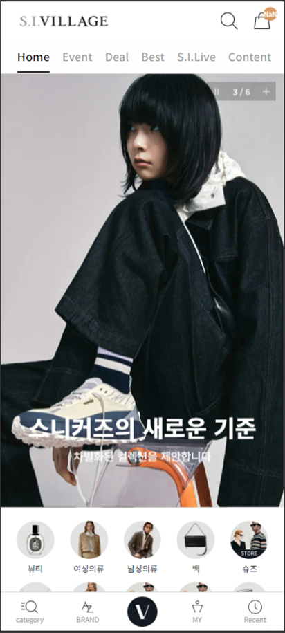
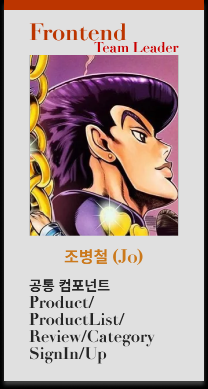
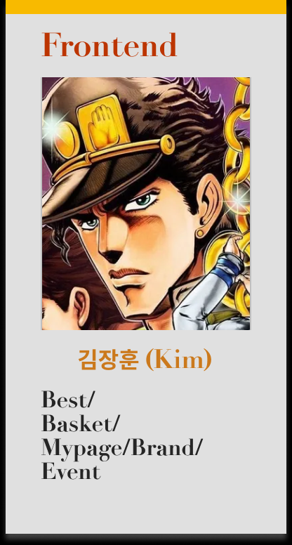
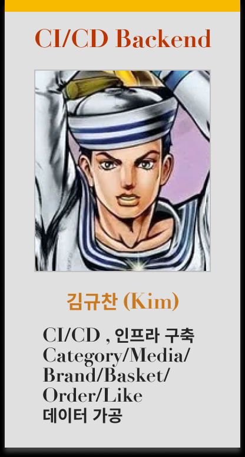
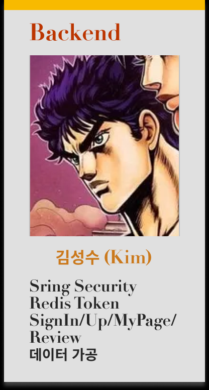
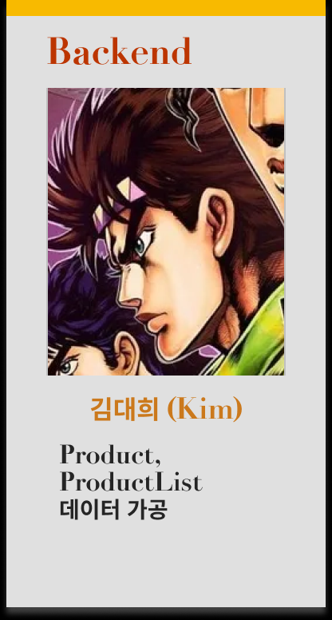
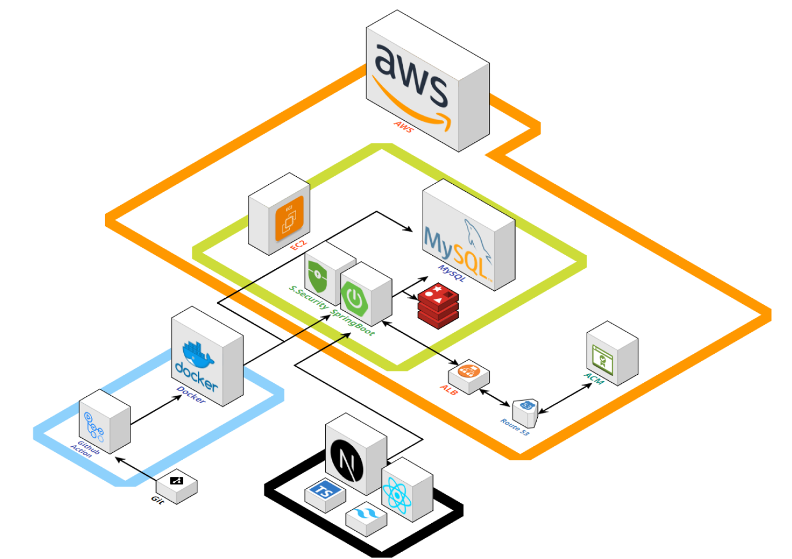
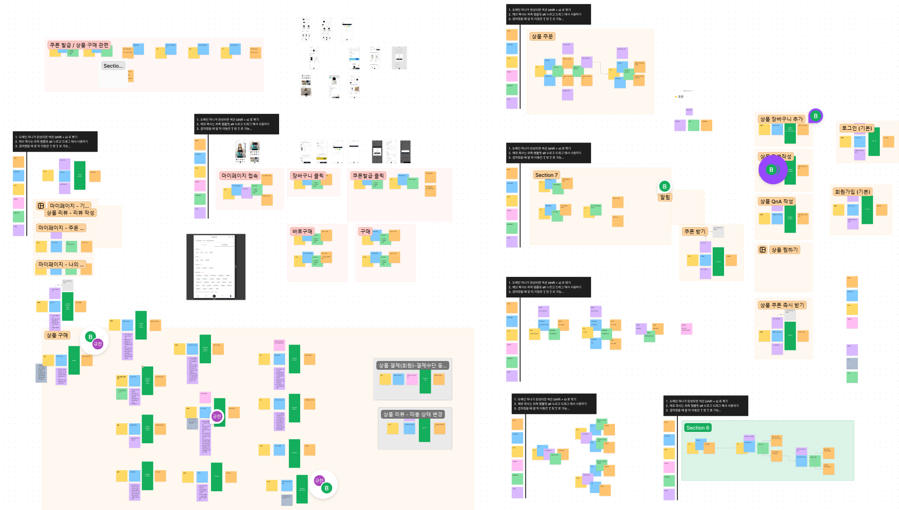

# 🛒 S.I.VILLAGE
신세계 인터내셔날 공식몰 S.I.VILLAGE 리빌딩 프로젝트 <br>
100만 명 이상의 사용자에게 대용량 데이터를 효율적으로 제공할 수 있는 시스템 설계를 목표로 S.I.VILAGE 스토어를 리빌딩합니다.

- **개발 기간** : 2024.08.06 ~ 2023.09.30 (6주)
- **플랫폼** : Web
- **개발 인원** : 5명 <br><br>

<div align="center">
  
</div>
<br><br>

## 🔎 목차
<div align="center">

### <a href="#developers">🌟 팀원 구성</a>
### <a href="#techStack">🛠️ 기술 스택</a>
### <a href="#systemArchitecture">🌐 시스템 아키텍처</a>
### <a href="#skills">📲 기능 구성</a>
### <a href="#directories">📂 디렉터리 구조</a>
### <a href="#projectDeliverables">📦 프로젝트 산출물</a>
</div>
<br>

## 🌟 팀원 구성
<a name="developers"></a>
<div align="center">
<table>
    <tr>
        <td height="420px" align="center"> <a href="https://github.com/bbang7">
             <br> 🌞 조병철 <br>(Frontend) </a> <br></td>
        <td height="420px" align="center"> <a href="https://github.com/jangdebug">
             <br> 🐱 김장훈 <br>(Frontend) </a> <br></td>
        <td height="420px" align="center"> <a href="https://github.com/gyudol">
             <br> 🏸 김규찬 <br>(Infra & Backend) </a> <br></td>
        <td height="420px" align="center"> <a href="https://github.com/aidzero01">
             <br> 🐹 김성수 <br>(Backend) </a> <br></td>
        <td height="420px" align="center"> <a href="https://github.com/everydayday">
             <br> 👨🏻‍💻 김대희 <br>(Backend) </a> <br></td>
    </tr>
</table>
</div>
<br>

## 🛠️ 기술 스택
<a name="techStack"></a>
### Frontend

<div align="center">

<br>


<br>


</div>

- **Language |** TypeScript
- **Runtime Environment |** Node.js 20.16.0
- **Framework |** Next.js 14.2.7, Tailwind CSS
- **Library |** Shadcn
- **IDE |** Visual Studio Code
- **Deploy |** Vercel

### Backend
<div align="center">


<br>


<br>


</div>

- **Language |** Java 17
- **Framework |** Spring Boot 3.2.9
- **Library |** Spring Data JPA, QueryDsl 5.0.0
- **Database |** MySQL 8.0.38, Redis 7.2
- **IDE |** IntelliJ IDEA 2024.2 (Ultimate Edition)
- **Build Tool |** Gradle 8.8.0

### DevOps
<div align="center">


</div>

### Collaboration
<div align="center">


</div>
<br>

## 🌐 시스템 아키텍처
<a name="systemArchitecture"></a>
<div align="center"> 


</div>

## 📲 기능 구성
<a name="skills"></a>
<div align="center"> 

**추가 예정**
</div>
<br>

## 📂 디렉터리 구조
<a name="directories"></a>
### Frontend
<details align="left">
  <summary>
    자세히
  </summary>

  ```
  추가 예정
  ```
</details>

### Backend
<details align="left">
  <summary>
    자세히
  </summary>

  ```
  추가 예정
  ```
</details>

## 📦 프로젝트 산출물
<a name="projectDeliverables"></a>
- <h3>💡 이벤트 스토밍</h3>
<div align="center"> 


</div>

- <h3>🗄️ ERD</h3>
<div align="center"> 


</div>

- <h3><a href="https://docs.google.com/spreadsheets/d/1ORgQ3SfN6lYpZYbLtl5h9VWyCNxmcLcOwg_KS7RETA0/edit?gid=118836952#gid=118836952" target="_blank">📅 WBS</a></h3>

- <h3><a href="https://docs.google.com/spreadsheets/d/1ORgQ3SfN6lYpZYbLtl5h9VWyCNxmcLcOwg_KS7RETA0/edit?gid=1474673446#gid=1474673446" target="_blank">📋 요구사항 정의서</a></h3>

- <h3><a href="https://docs.google.com/spreadsheets/d/1ORgQ3SfN6lYpZYbLtl5h9VWyCNxmcLcOwg_KS7RETA0/edit?gid=1680415821#gid=1680415821" target="_blank">📡 API 명세서</a></h3>